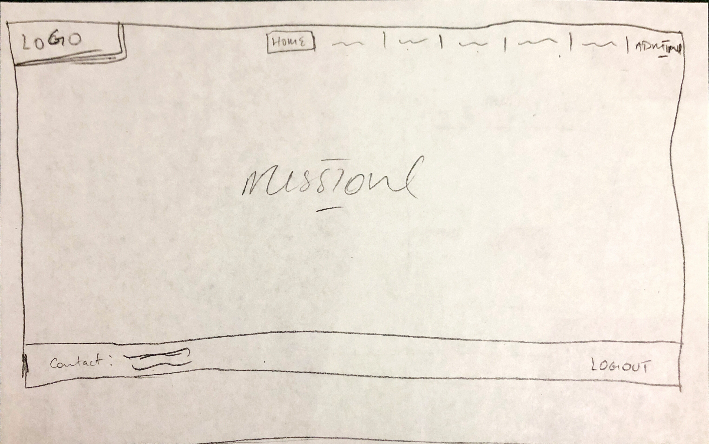
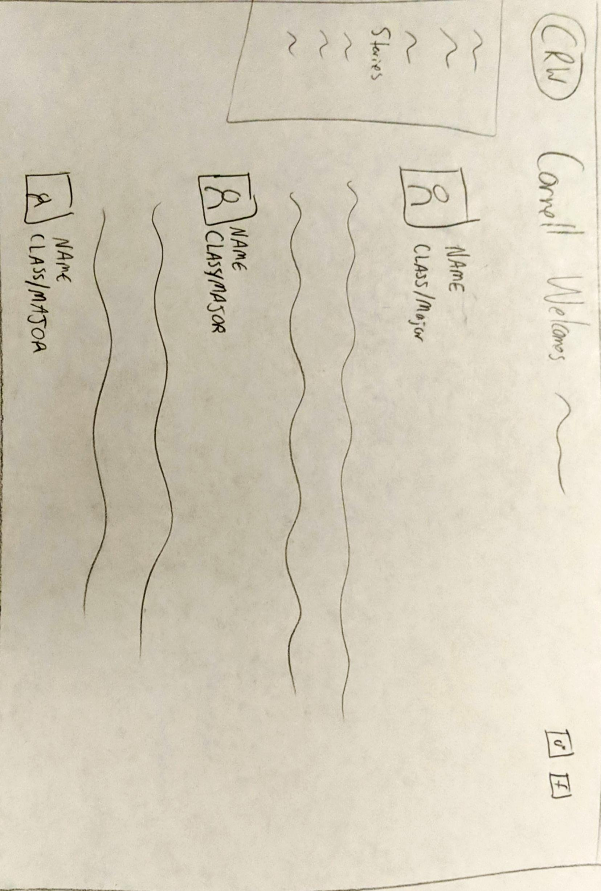
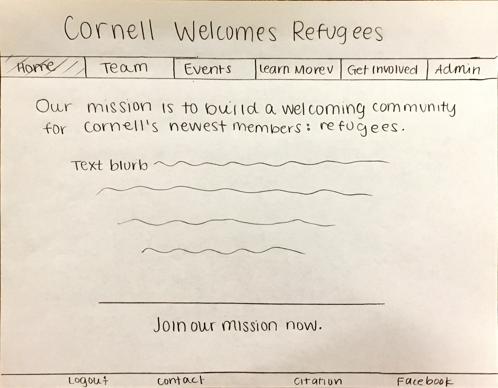
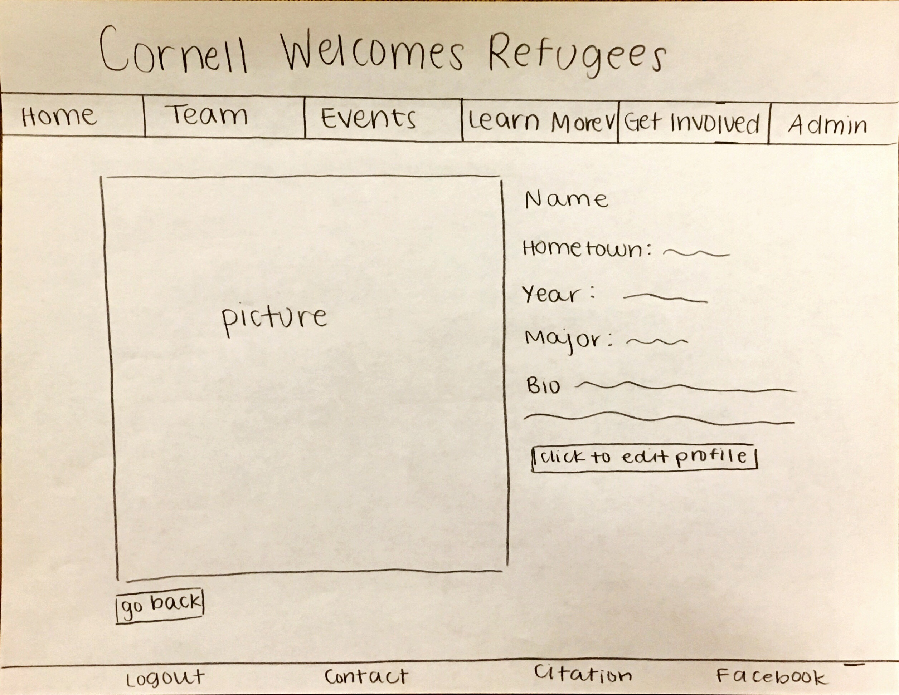
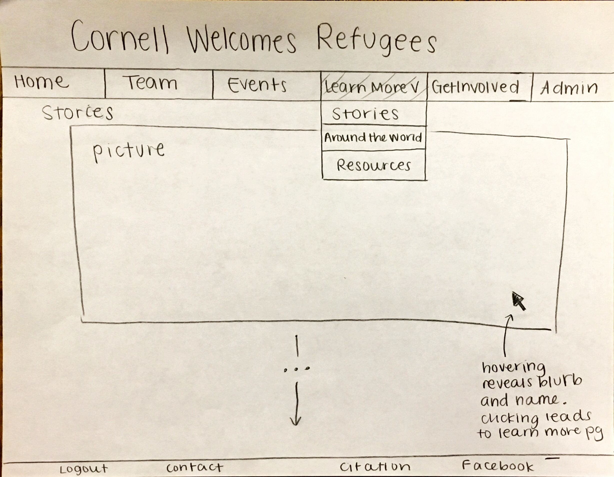

# Project 4: Design Journey

Your Team Name: Orange Scorpion

**All images must be visible in Markdown Preview. No credit will be provided for images in your repository that are not properly linked in Markdown. Assume all file paths are case sensitive!**


## Client Description

Cornell Welcomes Refugees
- CWR is an organization that is made up of Cornell students who want to provide a welcoming and fair environment for refugees and immigrants that attend Cornell or are hoping to attend to Cornell. They hope that they can make Cornell a welcoming school and home for refugees in a time of global need.
- They want to have a website that most represents a non-profit website, just without the ability to donate to them.  Meaning, they want a website that gives them a platform and a way to outsource info on their organization and their mission.
- Their key goals for this site are to connect the greater Cornell community with their cause, connect their members and outside website users to national organizations working with the same mission, and to make the site a source of information and advertising about their organization to the Cornell community (e.g., info on their organization like EBoard, upcoming events, mission statements, news and updates, etc.)


## Meeting Notes

Present:

Sophie Arzumanov
Adeyemi Oyemade
Jacob Chovanec
Malikul Muhammad
Tarannum Sahar

Used http://www.isucornell.com as a reference for what they would like the styling and content to look like
Login, contact, posting about events
Goals: “platform to spread our information”
> connecting wider Cornell community
> connecting people to other national organizations
> spreading information about events we are having,
> trying to create scholarships for refugees at Cornell so they want a platform to advertise that
Content Ideas:
> Who we are
> Who is on our team
> What our organization does
> How people can get involved
> What our current projects are
> Videos
> Timeline page 2017-2018-2019 (reference ISU events page)
> Universal username and password for their admins to add content to their events page for example


## Purpose & Content

The main purpose of this website is to connect the greater Cornell community with the cause of Cornell Welcomes Refugees. The site will serve as a source of information about their organization, as well as connect people with resources about refugees. This will include links to national organizations, information about their members, and lists of events, among other things. This site will also help CWR advertise their clubs and mission.

## Target Audience(s)

One target audience is people interested in contributing to the mission of Cornell Welcomes Refugees. They would interact with the website by using it to learn more about resources that they can use, as well as getting contacting information for people in the organization, and hearing about relevant events that they can get involved in.

Another target audience is people who are interested in joining Cornell Welcomes Refugees. They will be able to access the website from the Facebook page or word of mouth. They can use this page to join CWR by submitting their email to join the list serv, keeping up with upcoming events on the events page, and using the stats and stories pages to learn more about why this cause matters.

A final target audience is the administrators of CornelL Welcomes Refugees. They will use this website to update the information about their club. They can login to the administrative features using the login link in the footer, and then an additional Admin page will appear in the navigation bar. Here, they can add and delete people on the Teams page, and add and delete events on the Events page.

## Client Requirements & Target Audiences' Needs

Example:
- (_pick one:_) Client Requirement/Target Audience Need
  - **Requirement or Need** [What does your client and audience need or want?]
    - Client wants to cater to people who speak different languages.
  - **Design Ideas and Choices** [How will you meet those needs or wants?]
    - Create web-pages manually in multiple languages.
  - **Rationale** [Justify your decisions; additional notes.]
    - Create multiple pages in multiple languages manually.


- Target Audience Need
  - **Requirement or Need** [What does your client and audience need or want?]
    - The target audience needs an introduction to the CWR organization so they can get a brief idea on what they are about
  - **Design Ideas and Choices** [How will you meet those needs or wants?]
    - Add the CRW mission statement on the home page
  - **Rationale** [Justify your decisions; additional notes.]
    - the first thing the audience should see is the mission statement so that they can get an idea of what kind of org they are looking at when they browse the website


- Target Audience Need
  - **Requirement or Need** [What does your client and audience need or want?]
    - Audience needs a list of the team/eboard so that they know who is running the org and who to contact
  - **Design Ideas and Choices** [How will you meet those needs or wants?]
    - have a people (eboard/team) page that displays the names and contact info of the people on the team
  - **Rationale** [Justify your decisions; additional notes.]
    - this page will be an effective way to display who is running the org, most convenient way for users to see that


- Client Requirement
  - **Requirement or Need** [What does your client and audience need or want?]
    - Client wants a way to update events to their events list
  - **Design Ideas and Choices** [How will you meet those needs or wants?]
    - Create a form that will add an event to the database
    - display the events database in list format on their site
    - using login functionality, allow only eboard members to have access to the form
  - **Rationale** [Justify your decisions; additional notes.]
    - easy way for the eboard to be able to update the site without having to touch the code
    - using a login will prevent vandals from uploading unnecessary info onto the site


- Target Audience Need AND Client Requirement
  - **Requirement or Need** [What does your client and audience need or want?]
    - A form that will add interested people to be added to CWR's listserv
  - **Design Ideas and Choices** [How will you meet those needs or wants?]
    - Create a form for users to fill out with their information
    - results of this form sent to eboard, so that the eboard can add the interested people to the eboard
    - will do this on a "get involved page"
  - **Rationale** [Justify your decisions; additional notes.]
    - a form is the easiest way for our client to get the user info that they need.

- Target Audience Need
  - **Requirement or Need** [What does your client and audience need or want?]
    - Links to the organizations social media
  - **Design Ideas and Choices** [How will you meet those needs or wants?]
    - these links can be added throughout the website, in a header or footer
    - can also be added to an interest/get involved page
  - **Rationale** [Justify your decisions; additional notes.]
    - adding these to the header or footer gives the user an incredibly easy way to get to the social media

- Client Requirement
  - **Requirement or Need** [What does your client and audience need or want?]
    - Client wants to share stories of refugees from different nations, so that their audience can see how important this issue is
  - **Design Ideas and Choices** [How will you meet those needs or wants?]
    - feature refugee stories on an our stories/impact page
  - **Rationale** [Justify your decisions; additional notes.]
    - these stories should be on a part of the website where CWR is educating the audience/getting the audience to sympothize about/with their mission

- Target Audience Need
  - **Requirement or Need** [What does your client and audience need or want?]
    - Events that CWR is organizing/info and pics from events that already happened
  - **Design Ideas and Choices** [How will you meet those needs or wants?]
    - create an events page with a list of upcoming events, pics of events, and info on past events
  - **Rationale** [Justify your decisions; additional notes.]
    - a comprehensive events page will make it easy and convenient for the audience to get all the info they need on CWR's events

- Client Requirement
  - **Requirement or Need** [What does your client and audience need or want?]
    - Client wants to display stats on refugees displaced from their native countries
  - **Design Ideas and Choices** [How will you meet those needs or wants?]
    - add these stats to an our stories/impact/about page
  - **Rationale** [Justify your decisions; additional notes.]
    - showing these stats on their site will educate/get sympathy on/for the CWR cause.


## Initial Design

We first made an initialize design with multiple iterations of each page to brainstorm our ideas. Each page was drawn by multiple members of our team so that we could get all of our ideas on paper.








## Information Architecture, Content, and Navigation

- **Navigation**
  - Home
    - Logo
    - Mission
    - Login
  - Teams
    - Names
    - Pictures
    - Blurbs
  - Events
    - Upcoming
    - Highlights
    - Pictures
  - Stories
    - Refugee stories
    - Pictures
  - Stats
    - statistics and infographics by country
  - Contact
    - get involved form
    - social media links
  - Admin (only shows up when logged in)
    - form to add/remove events
    - form to add/remove members

- **Content** (List all the content corresponding to main navigation and sub-categories.)
  -  **Home**: mainpage of website
  - **Logo**: CWR logo
  - **Mission**: mission statement of CWR, definition of refugee
  - **Login**: link to login to website, adds admin tab once lagged in
  - **Teams**: the teams of CWR, introduces their roles and members
  - **Names**: members and eboard
  - **Pictures**: pictures of members and eboard
  - **Blurbs**: small description of year/major/involvement/story of members and eboard
  - **Events**: gives events CWR has and will host
  - **Upcoming**: calendar of events that CWR will be hosting or community events
  - **Highlights**: past events with blurbs and pictures
  - **Pictures**: pictures from past events
  - **Stories**: stories of refugees
  - **Refugee stories**: first-hand accounts from refugees
  - **Pictures**: pictures to accompany first-hand accounts
  - **Stats**: statistics about refugee crises and the reality of the life of refegees
  - **statistics and infographics by country**: lists various statistics about crises and has infographics to visualize of the the statistics
  - **Contact**: page with information so that interested students can get involved
  - **get involved form**: form to be added to listserve
  - **social media links**: links to facebook, instagram, twitter ect
  - **Admin (only shows up when logged in)**: page to alter content, only for CWR members
  - **form to add/remove events**: allows CWR to change their event calendar as needed
  - **form to add/remove members**: allows CWR to update the website when their eboard changes

- **Process**
 

We came up with our card sorting by looking at the content sheet that our client supplied to us, as well as the meeting minutes from our in-person meeting. From here, we were able to come up with bigger categories that turned into each page, and added the subcontent based on the specfiic paragraphs, photos, and desired functionalities they supplied to us. The process was very free-flowing and open to all ideas.


## Interactivity

* Navigation Highlight - clicking on a page will add a shade and indicator around the page's name.
- PHP element: setting a variable based on the current page.
- Target audience: this allows users of the website to know what page they are in for ease of navigation.

* Hovering, Teams Page - The Team page will be an interactive photo gallery. The images will have a hovering feature where they will have a black and white overlay. The user will be able to click on the image of that person to learn more about them.
  - PHP element: Click yields a get query which leads to another page the uses SQL to fill in that person's information.
  - Target audience: people interest in the club can learn about the members.

* Edit profile, Profile Page - Clicking on an image on the Team page will lead to a profile page of one person. The user will see a button where they can edit the profile if they are logged in.
  - PHP element: checks if they are logged in, interactive form with variables.
  - Target audience: administrators of the club can keep the page up to date.

* Hovering, Stories Page - The Stories page will be an interactive photo gallery. The images will have a hovering feature where they will have a greyish overlay with the name of the refugee, the country, and a blurb about their experience. It will prompt the user to click to learn more.
  - PHP element: Click will send the user to a page where the image will be displayed and the story of the person will be displayed. Accessing data from the database through the get element, and information from the database will be rendered through the connection.
  - Target audience: people interested in getting involved in the mission will be able to become informed.

* Drop downs, Resources and Around the World - There will be drop downs on these two pages.
  - PHP element: if/else statement
  - Target audience: people trying to learn more can do so without having the page be too clutted.

* Login: A login function will be at the footer of the page. It is not at the top is because it is not meant for the audience but for the administrators, so it's not meant to be in plain sight. When an administrator is logged in a new paged will be rendered in the navigation bar so that the admin will be able to add and delete members, and events.
  - PHP element: form with variables and SQL queries.
  - Target audience: administrators can keep the website up to date.

* Get Involved: Form to allow people to submit the username and password and sign up for the listserv.
  - PHP element: form with variables and SQL queries.
  - Target audience: people try to join and learn more can do so.

* Admin Page: The admin page has forms to allow the administrators to delete/add events and members.
  - PHP element: forms and validation. SQL queries.
  - Target audience: administrators can keep the website up to date.

## Work Distribution

* Deadlines
  > April 13th - Meet with the client and receive information.
  > April 22nd - Meet as a group to brainstorm the design and establish responsibilities.
  > April 27th - Meet with the client to get feedback.
  > Week of April 28th - Work hard on developing the code.
  > May 3rd - Work on design/CSS after getting feedback from other groups.
  > May 4th - Meet to divide up final tasks.
  > May 7th - Submit by 4 pm.

  * Tasks and Dependencies
    > Milestones
      > all members contributed to milestone
      > Sophie cleaned up and perfected all of them.
    > Database
      > Nikki creates all databases
      > Sophie adds more and modifies
    > Interactivity
      > Yemi is in charge of creating ideas for interactivity
      > All other members help implement
    > Header and Nav Bar
      > Nikki created
      > Get feedback from the group
      > Sophie makes modification proposals
      > Nikki makes final design after brainstorming how to improve
      > Sophie makes final header design
    > index.php
      > Jacob creates design of homepage
      > Team evaluates
      > Sophie makes final design based on feedback
      > Team approves
    > team.php
      > Sophie makes the team page
      > Get feedback
      > Modify team page
      > Sophie works with CWR to get information for the team page
    > profile.php
      > Sophie adds idea for interactivity
      > Yemi adds form interactivity for admins to change profile
    > events.php
      > Jacob creates and adds to database
      > Jacob designs page and works with CWR to get images
      > Team gives feedback
    > stories.php
      > Sophie adds initial content
      > Yemi works on interactivity and final design
    > world.php
      > Nikki add initial information
      > Nikki adds interactivity
      > Team approves
    > resources.php
      > Sophie designs and creates
      > Add database for the resource categories
      > Team approves
    > getinvolved.php
      > Nikki creates the page
      > Yemi works on forms
    > admin.php
      > Sophie creates the two forms and modifies Nikki's databases
      > Jacob adds information to the forms
      > Nikki works on the setup of the forms
      > Sophie styles all of the forms
    > Filtering input and escaping output
      > Nikki does at the end of everything. Depends on all other pages being completely done.
    > Validation
      > Jacob validates all pages
      > Nikki and Yemi check his work
    > Styling
      > Jacob pitches a style
      > All team members contribute and develop the style
      > Sophie standardizes and normalizes the style using a color palette
    > Login In
      > Yemi creates the sign in page

## Additional Comments

We have a GroupMe with CWR and are in constant communication with them.

--- <!-- ^^^ Milestone 1; vvv Milestone 2 -->

## Client Feedback

Doesn’t like statistics as its own page
Doesn’t like the definition of refugee on home page
Stories page is tenative
Change teams page to something like “who we are”
current/future eboard mash
Events page good
Wants the stories page to be like a picture of the person, their story, picture of the country they are from to show the rough conditions and go back and forth between pics and text
Maybe make pics low opacity and put text over them
Definitely change the name of the statistics page
Not just statistics
Something like “around the world”
Maybe call it learn page
Wants us to look into doing like a nested nav bar
Click on a link and it opens multiple links
Could combine stories and statistics
Learn tag
Wants social media links in footer
Likes the admin page idea
Likes yemis team sketch
Likes the scroll vertical stats page
Don’t include netID’s on get involved form
Not just for CU people
Likes first admin page


## Iterated Design

We then met with Cornell Welcomes Refugees and they told us what elements they liked and didn't like. We used this to make an intermediate design in order to get started with our implementations.


- change name of statistics page to Around the World
- combine stories and around the world into one link on the nav bar and call it Learn.  When you hover over learn, it drops down into the two options.
- add social media links to the footer instead of having them stick out on their page.
- Teams page will have a name change, TBD, because they do not know exactly who will be on the "Team" page yet
- We are going to make the eboard page more like a photo gallery
- going to make the around the world page a scroll format
- add a link to the admin login in the footer
- make sure that the get involved form doesn't have anything related to being a Cornell student (year, netID labels) so that members of the outside community can join as well


## Evaluate your Design

We selected Abby because she is most unlike our group. This will give us greater insight into things we may have not already considered. While our team has a 50/50 gender split, we are all comfortable and knowledge about technology and try new things. Her more cautious attitude will help us consider the accessibility of our website.

### Tasks

Task 1: Sign up for the CWR listserve
  Subgoal 1: Go to signup page
  1. click on the "get involved" page in the navigation bar.
  Subgoal 2: fill out the get involved form
  1. locate the form to fill out
  2. fill out the name section
  3. fill out the email section
  5. click submit

Task 2: Learn more about one of the members of the club
  Subgoal 1: Go to teams page
  1. click on the "teams" page in the navigation bar.
  Subgoal 2: Go to that person's profile page
  1. scroll through page
  2. locate the member
  3. click on the member
  4. read the desired information

### Cognitive Walkthrough

#### Task 1 - Cognitive Walkthrough

**Task name: Sign up for the CWR listserve**
**Subgoal # 1 : Go to signup page**
  - Will Abby have formed this sub-goal as a step to their overall goal?
    - Yes, maybe or no:  Maybe
    - Why? She may not realize that a different page exists for her to do this.
    **Action #1: click on the "get involved" page in the navigation bar.**
      - Will Abby know what to do at this step?
        - Yes, maybe or no: Maybe
        - Why? She may not know that Get Involved is the correct page that will allow her to submit her email to the listserv. She may click around a bit before getting to the right page, and may get discouraged.

      - If Abby does the right thing, will she know that she did the right thing, and is making progress towards her goal?
        - Yes, maybe or no: Yes
        - Why? The title of the main body of the page is "Join Our Listserv!" so she will be validated that she made the correct action.

**Subgoal # 2: fill out the get involved form**
- Will Abby have formed this sub-goal as a step to their overall goal?
  - Yes, maybe or no:  Yes
  - Why? She will see the title "Join Our Listserv!". Based on Abby's experience, this is enough information for her to know that she has gotten to the right form and will fill it out. Abby is keen on accomplishing the goals and the title will validate her.

  **Action #1: find the form to fill out**
    - Will Abby know what to do at this step?
      - Yes, maybe or no: Yes
      - Why? The form is right below "Join Our Listserv!" which validates her.

    - If Abby does the right thing, will she know that she did the right thing, and is making progress towards her goal?
      - Yes, maybe or no: Maybe
      - Why? She will not know until she submits the form and gets feedback.

    **Action #2: fill out the name section**
    - Will Abby know what to do at this step?
      - Yes, maybe or no: Yes
      - Why? The label is clear and Abby has used software in the past.

    - If Abby does the right thing, will she know that she did the right thing, and is making progress towards her goal?
      - Yes, maybe or no: Maybe
      - Why? She will not know until she submits the form and gets feedback.

  **Action #3: fill out the email section**
    - Will Abby know what to do at this step?
      - Yes, maybe or no: Yes
      - Why? The label is clear and Abby has used software in the past.

    - If Abby does the right thing, will she know that she did the right thing, and is making progress towards her goal?
      - Yes, maybe or no: Maybe
      - Why? She will not know until she submits the form and gets feedback.

  **Action #4: click submit**
    - Will Abby know what to do at this step?
      - Yes, maybe or no: Yes
      - Why? The label is clear and Abby has used software in the past.

    - If Abby does the right thing, will she know that she did the right thing, and is making progress towards her goal?
      - Yes, maybe or no: Yes
      - Why? The page will say "Thanks for joining our Listserv!" which will validate her.


#### Task 2 - Cognitive Walkthrough

**Task name: Learn more about one of the members of the club **

**Subgoal # 1 :  Go to teams page**
  - Will Abby have formed this sub-goal as a step to their overall goal?
    - Yes, maybe or no:  Yes
    - Why? Abby knows that not all information on a site will be on the front page.  This is familar to her.
    **Action #1: click on the "team" page in the navigation bar**
      - Will Abby know what to do at this step?
        - Yes, maybe or no: Maybe
        - Why? Abby is not familiar with our website and may not know that "Team" is associated with the members of the executive board of CWR. She may be skeptical of whether or not this is the right place to go. She may click around a bit and get discouraged.

      - If Abby does the right thing, will she know that she did the right thing, and is making progress towards her goal?
        - Yes, maybe or no: Yes
        - Why? She will see team members and know that she got to the right page. It will validate her.

**Subgoal # 2: Go to that person's profile page**
- Will Abby have formed this sub-goal as a step to their overall goal?
  - Yes, maybe or no:  Yes
  - Why? Abby is goal-oriented and knows that she needs to locate the individual person.

  **Action #1: scroll through page**
    - Will Abby know what to do at this step?
      - Yes, maybe or no: Yes
      - Why? Abby has used software before and likely knows how to scroll to see all of a list.

    - If Abby does the right thing, will she know that she did the right thing, and is making progress towards her goal?
      - Yes, maybe or no: Yes
      - Why? She will find the person she is looking for.
  **Action #2: locate the member**
    - Will Abby know what to do at this step?
      - Yes, maybe or no: Yes
      - Why? She has used software before and will know once she sees who she is looking for because there isn't an overwhelming amount of information and it will validate her.

    - If Abby does the right thing, will she know that she did the right thing, and is making progress towards her goal?
      - Yes, maybe or no: Yes
      - Why? She will see the person and it will validate her.

  **Action #3: click on the member**
    - Will Abby know what to do at this step?
      - Yes, maybe or no: Maybe
      - Why? She may not know that clicking will get her to the right information.

    - If Abby does the right thing, will she know that she did the right thing, and is making progress towards her goal?
      - Yes, maybe or no: Yes
      - Why? She will be taken to a page with more information.


### Cognitive Walk-though Results

[Did you discover any issues with your design? What were they? How will you change your design to address the gender-inclusiveness bugs you discovered?]

[Your responses here should be **very** thorough and thoughtful.]

We found a few issues with our design after going through the Cognitive Walk-through.

First, the user may not know that "Get Involved" is the correct page to go to in order to join the Listserv. Get Involved could mean a lot of things to a lot of people, and if the navigation bar is overwhelming, then the person might get discouraged when trying to figure out if they can join the Listserv. To address this, we are going make sure that our navigation bar is not cluttered and that all of the other labels on the navigation bar would not suggest that there could be any doubt about the where to go in order to join the listserv. We are glad to have realized this as we want Cornell Welcomes Refugees to have an easy time getting members to join, and to fulfill the target audience's needs for all types of audience members.

Second, the user may not be able to figure out that more information about a person is accessible via the team page. This was evident as we realized that when Abby got to the Team page, if she knew to get there, she may not know that more information is available by clicking. We realized two things that could help inform our design process. First, like mentioned above, we are going to make sure that the navigation bar is completely clear and that a user would have no question about whether or not they needed to try a different page. This is so that no user gets discouraged and is unsucessful in using the website. We want everyone to have a good, smooth experience, Second, we realized that we need to make it obvious that the images of the people are clickable. We decided to implement hovering. Mousing over the images greys it out, which indicates that they are clickable. The user will be curious and proceed, thus finding more information.

We are satisfied that we chose Abby for our Cognitive Walk-through as we may not have otherwise uncovered these issues. This process yielded good discussion about making sure that the needs of our client and target audience is satisified for all types of users.


## Final Design








- we created a drop-down menu and combined the Stories, Around the World, and Resources pages in the Nav Bar so that it wouldn't get too cluttered for inexperienced or new users
- we added more fields in our forms on the admin page to increase the customizability and interactivity
- we removed the definition of a refugee from the home page per the request of the client
- we moved the facebook link to the footer
- we added appropriate citations
- we created drop downs on the informational pages so that the user does not get overwhelmed
- we made the team page have just pictures, so that when they click they get to a new page with more information about the team
- we made the stories more centered around pictures and short blurbs for each person side by side
- we called the "stats" page "Around the World" per the client's request
- we made a login page instead of having it in the footer
- we made more minimalist style choices because of our brainstorming process and after completing the Cognitive Walk-through


## Database Scheme

Table: events
* id: integer {pk, u, not null, ai} --surrogate primary key
* name: text {not null}
* startdate: text {not null}
* enddate: text
* starttime text
* endtime TEXT
* photo_name TEXT
* photo_ext TEXT
* source TEXT

Table: resources
* id: integer {not null, pk, ai, u}
* resource_id: integer {not null}
* resource_description: text {not null}
* resource_link: text {not null}

Table: resource_types
* id: integer {not null, pk, ai, u}
* name: text {not null}

Table: countries
* id: integer {not null, pk, ai, u}
* country: text {not null}
* picture_name: text {not null}
* picture_ext: text {not null}
* pic_source: text {not null}
* pic_source_link: text {not null}
* pic_alt: text {not null}

Table: country_facts
* id: integer {not null, pk, ai, u}
* country_id: integer {not null}
* term: text
* fact: text {not null}

Table: people
* id: integer {pk, u, not null, ai} --surrogate primary key
* name: text {not null}
* year: integer {not null}
* major: text {not null}
* hometown: text {not null}
* bio: text not null
* picture_name: text {Not null}
* picture_ext: text {Not null}
* pic_source: text {Not null}

Table: users
* id: integer {pk, u, not null, ai} --surrogate primary key
* user_name: text {u, not null}
* password: text {not null}

Table: sessions
  * id: integer {pk, u, not null, ai} --surrogate primary key
  * user_id: integer {Not null} -- foreign key
	* session: text {unique, Not null}

Table: listserve
* id: integer {pk, u, not null, ai} --surrogate primary key
* name: text {not null}
* email: text {not null, u}

Table: stories
* id: integer {pk, u, not null, ai} --surrogate primary key
* country: text {not null}
* story: text
* picture_name: text {Not null}
* picture_ext: text {Not null}
* pic_source: text {Not null}
* pic_source_link : text {Not null}


## Database Queries

> events.php
``` sql
  SELECT * FROM events;
```

> team.php
``` sql
  SELECT * FROM people
```

> getinvolved.php
```sql
INSERT INTO listserve (name, email) VALUES (:name, :email)
```

> world.php
```sql
SELECT * FROM countries
```

> resources.php
```sql
SELECT * FROM resource_types
```

> stories.php
```sql
SELECT * FROM stories WHERE id = :story_id
SELECT * FROM stories
```

> login.php
```sql
SELECT * FROM sessions
SELECT users.user_name, users.id FROM users INNER JOIN sessions ON users.id = sessions.user_id
SELECT * FROM users WHERE user_name = :username
INSERT INTO sessions (user_id, session) VALUES (:user_id, :session)
DELETE FROM sessions
```

> admin.php
```sql
INSERT INTO events (". $events .") VALUES (" . $values . ")
INSERT INTO people (name, year, major, hometown, bio, picture_name, picture_ext) VALUES (:name, :year, :major, :hometown, :bio, :headshot_name, :headshot_ext)
SELECT * FROM events WHERE events.id = :user_input
DELETE FROM events WHERE events.id = :user_input
SELECT * FROM people WHERE people.id = :user_input
DELETE FROM people WHERE people.id = :user_input
SELECT * FROM events
SELECT * FROM people
```

## PHP File Structure

[List the PHP files you will have. You will probably want to do this with a bulleted list.]

> main
* admin.php
* events.php
* getinvolved.php
* index.php
* login.php
* profile.php
* resources.php
* stories.php
* team.php
* world.php
> includes
* country.php
* footer.php
* head.php
* header.php
* init.php
* loginfunctions.php
* oneEvent.php
* person.php
* resource.php
* story.php

## Pseudocode

[For each PHP file, plan out your pseudocode. You probably want a subheading for each file.]

> main
* admin.php
```
include init.php

include head.php

include header.php

include footer.php

if delete event submit
  sql for delete
  delete event from event page

if delete member submit:
  sql to add delete member
  delete memebers from team page

if add event submit:
  validform = true
  title = usertitle
  date = userdate
  time = usertime
  description = userdescription
  if title is empty
    valid form is false
    displaymessage ("Please fill out a title")
  if date is empty
     valid form is false
    displaymessage ("Please select a date")
  if time is empty
     valid form is false
    displaymessage ("Please put in a time time")
  if description is empty
     valid form is false
    displaymessage ("Please fill out the description")

  if validform is true
  sql to add values into the events table
  add event to the table
  display message ("added event successfully!")

else:
 title = ''
  date = ''
  time = ''
  description = ''


if add members submit:
  name = userinputname
  photo = userinputphoto
  year = userinputyear
  position = userinputposition

  if name is empty:
     valid form is false
    displaymessage ("Please fill out the person's name")
  else:
    if name in teams aleady:
      validform is false
      display message ("He is already a member")
  if photo is empty:
    validform is false
    display message( "please provide an image of the person")
  if year is empty:
    validform is false
    display message ("please provide the year of the person")
  if position is empty:
    set position to 'Member'

  if validform is true:
    sql to add member to team
    add member to team
    display message ("You have added this person successfully")
  else:
    display message ("fail to submit form")
else:
   name = ''
  photo = ''
  year = ''
  position = ''
  ```
* events.php
```
select all of the events
loop through all of the events
  save the event name
  save the start date
  save the end date
  save the start time
  save the end time
  save the location
  save pic name
  save pic ext
  save pic source
```
* getinvolved.php
```
if submitted
  insert into the listserv
  check if all of the inputs are valid

if all of the submissions are valid
  thanks for joining
else
  join our listserv
  blub
  form
    name field
    email field
    submit button
```
* index.php
```
mission statement
mission blurb
```
* login.php
```
if login submit button is pressed
  save username
  save password
if the user logs out
  log out
if the user is signed in
  you are logged in message
else
  sign in page
  login form
    username
    password
    submit button
```
* profile.php
```
include init.php

include head.php

include header.php

include footer.php

if id = null:
  refresh page

if edit member selected:
  name = name
  year = year
  major = major
  hometown = hometown
  bio = bio

  if edit_*a particular field* = null:
    set the field value to the previous field

  if add_to_profile:
    display edit form
  else:
      hide error

    if name error:
      display error message
    if year error:
      display error message
    else:
      hide error

    foreach year in list of years:
      display the year in a dropdown

    if major error:
      display error
    else:
      hide error

    if hometown error:
      display error
    else:
      hide error

    if bio error:
      display error
    else:
      hide error

  else:
    display normal team page

  if signed in:
    display edit profile button
```
* resources.php

```
if get resource != resource id:
  echo resource= + resource id + resource type
else:
  echo resources.php + resource type

foreach resources as resource:
  echo list element of that resource.

```
* stories.php

```
include init.php

include head.php

include header.php

include footer.php

include story.php

if overlay is clicked on (GET[id]) :
  select stories with id = id

  foreach stories as story:
    name = name
    country = country
    blurb = blurb
    thisstory = story
    pic name = pic name
    pic ext = pic ext
    source = source

  echo name and country

  echo image

  echo blurb

  echo story

  echo source

else:
  select all stories

  foreach stories as story:
    name = name
    country = country
    blurb = blurb
    thisstory = story
    pic name = pic name
    pic ext = pic ext
    source = source


```

* team.php

```
include init.php

include head.php

include header.php

include footer.php

foreach people as person:
  id = id
  name = name
  year = year
  pic name = pic name
  ext = ext
  link = link

include person.ph

```
* world.php
```
include init.php

include head.php

include header.php

include footer.php

foreach countries as world:
  country = country
  pic name = pic name
  pic ext = pic ext
  pic source = pic source
  pic source link = pic source link
  pic alt = pic alt

include country.php
```
> includes
* country.php
```
if country != country id:
  echo link with country id

  echo country in h2

else:
  foreach facts as fact:
    if fact = specific fact:
      echo that specific fact as class term
    if term = null:
      echo just the fact
    if term = specific term:
      echo just that term's fact with class defn.
    else:
      echo term with class term and fact with class defn
```

* footer.php
```
if the user is not signed in
  show the log in button
else
  show the log out button
contact us link
source
facebook link
```
* head.php
```
if the person is signed in
  signed in css
else
  default css
```
* header.php
```
display the header title
find the current page
check if its the current page for all pages
  if it is, make it a different color
```
* loginfunctions.php
```
array of error messages
signed in
  sign in function to check if they are signed in
get user
  fetch the user if they are signed in
log in
  check if the user exists
    if yes, check the password
      if password is verified, create a sesssion
log out
  delete the session
```
* oneEvent.php
```
echo the event
echo the information
```
* person.php
```
echo the pictures
echo the name
echo the permission
make the pictures clickable
```
* resource.php
```
check if the resource is the selected one.
  if not, just show the down arrow and resource type
else
  drop down the menu
  query the resource database
  get all of the resources
  display them
```

* story.php
```
echo the picture of the story
echo the name
echo the blurb
echo the story
go back button
```
## Additional Comments

None.


--- <!-- ^^^ Milestone 2; vvv Milestone 3 -->

## Issues & Challenges

* We had a hard time getting content from the client. They did not respond to our GroupMe messages and they would get frustrated with us becuase they thought we should have been working on the design when we really just needed the content. We final came to an agreement about them supplying us with content and they sent us a lot at once.
* It took us a while to finalize what kind of design we wanted. Solving this issue took a lot of iteration, but we got there.
* We had a hard time figuring out interactivity. It was sparse at first. After getting feedback from other teams, and seeing other websites, we got a lot of ideas.

--- <!-- ^^^ Milestone 3; vvv FINAL SUBMISSION-->

## Final Notes to the Clients

We were unable to find a way to connect the listserv to the GetInvolved page, but we will find a way to do so after the submission of our project.

We were unable to meet with our main point of contact to get feedback on the final design because we was out of town and busy when we could, so we are happy to do so at your earliest convenience.

## Final Notes to the Graders

[1. Give us three specific strengths of your site that sets it apart from the previous website of the client (if applicable) and/or from other websites. Think of this as your chance to argue for the things you did really well.]

Our website does a really great job of having a ton of valuable information and resources without looking too wordy, cluttered, or confusing. We have a very minimalist style, yet the website is rich with information. The website is also very customizable, and it is easily customizble through the admin functionality, even for someone who does not know anything about PHP/HTML/CSS/SQL.

[2. Tell us about things that don't work, what you wanted to implement, or what you would do if you keep working with the client in the future. Give justifications.]

We would like to work with the client in the future to launch this website; they are very passionate about this and we want the website to go live.

We also would like to meet with them in order to get feedback on the design. We were unable to do so as the main point of contact was out of town when we were able to meet.

Lastly, we want to find a way to make the GetInvolved page actually add people to the listserv.

[3. Tell us anything else you need us to know for when we're looking at the project.]

We have nothing to add-- we had a great time working on this, thank you so much!
